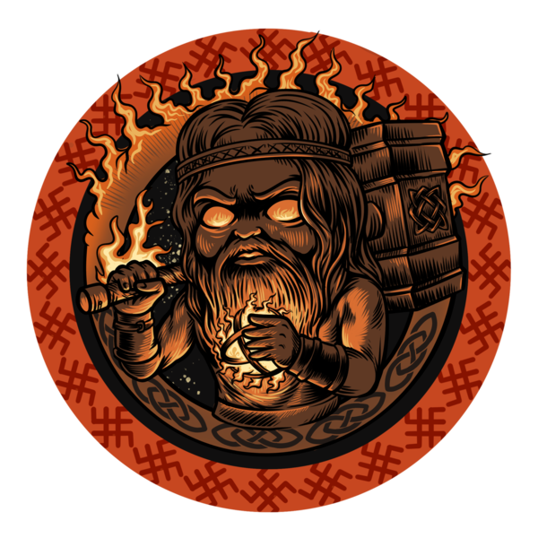
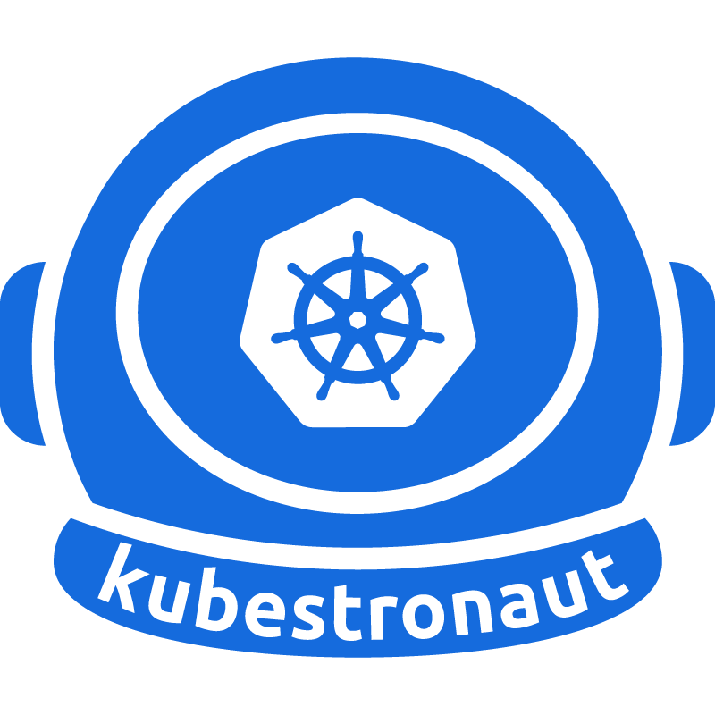
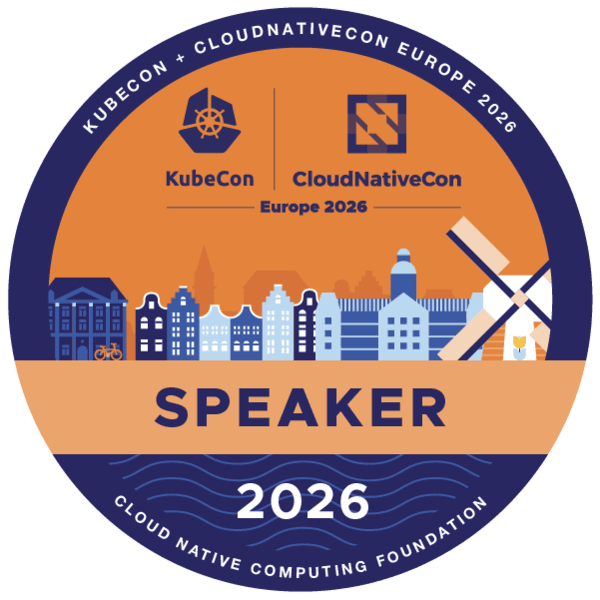
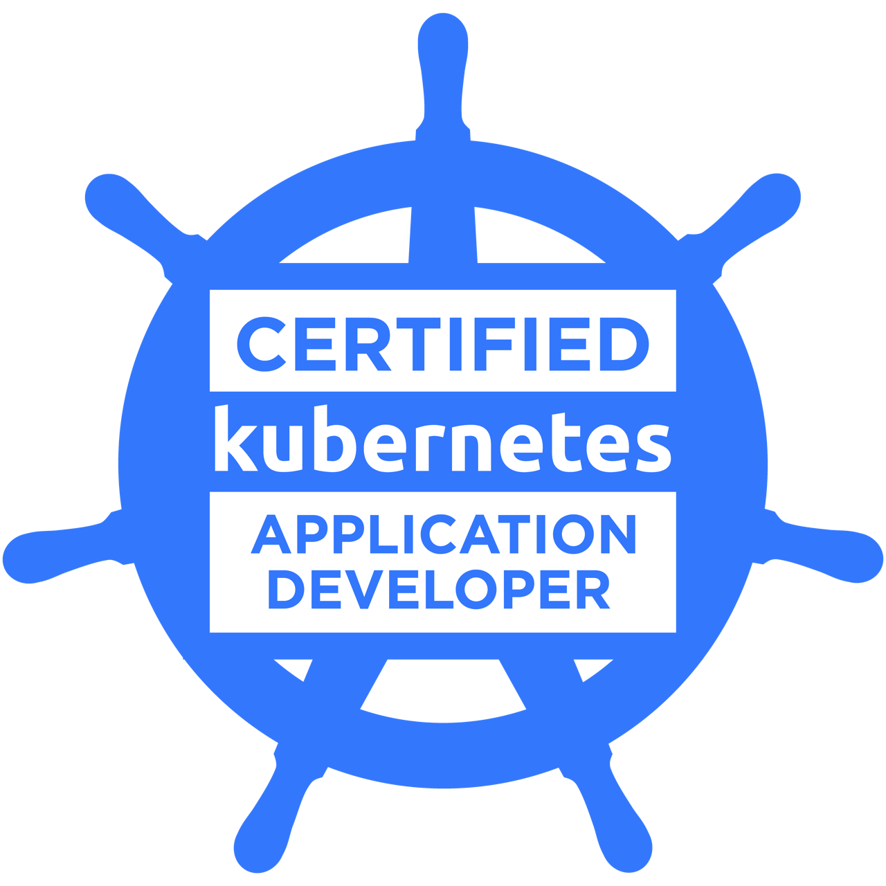
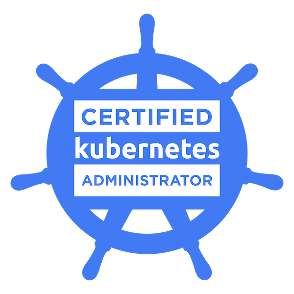
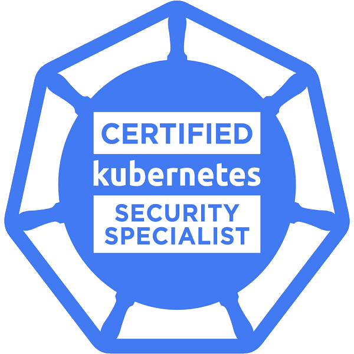
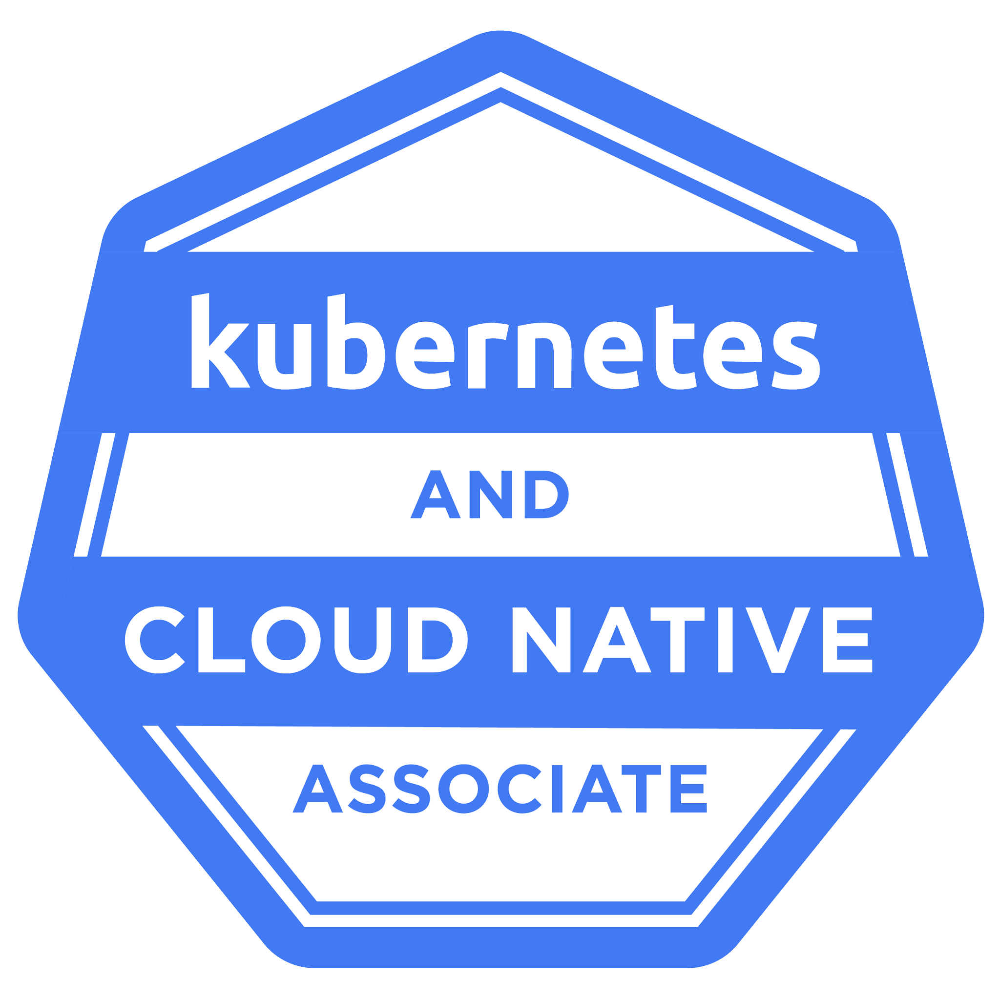
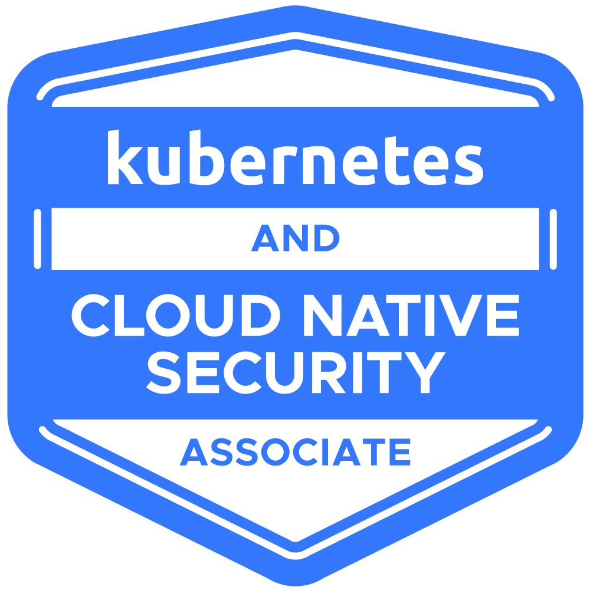

<!--
  PROFILE README - Vision: "Kubernetes Multi-Tenancy Authority"
  Sections marked TODO need one value from you (LinkedIn URL, talk rows, RSS feed).
  Everything else updates itself: shields badges + stats cards render live,
  the contribution snake is regenerated daily by .github/workflows/snake.yml.
-->

# Hristo Hristov

**I make Kubernetes safe to share.** Maintainer of [Project Capsule](https://projectcapsule.dev/),
Kubestronaut, and CNCF community contributor working at the intersection of
**multi-tenancy, cluster security, and platform reliability**.

<!-- TODO: replace CHANGE-ME with your real LinkedIn handle -->
[Website](https://hhristov.info) ·
[LinkedIn](https://www.linkedin.com/in/CHANGE-ME) ·
[Kubernetes Slack](https://kubernetes.slack.com/team/U07BVSYJC64) ·
[me@hhristov.info](mailto:me@hhristov.info)

---

## 🧩 What I Work On

I focus on the hard part of platform engineering: letting many teams share
infrastructure **without stepping on each other or breaking isolation.**

| | Pillar | What it means |
|---|---|---|
| 🏢 | **Multi-Tenancy** | Turning single clusters into safe, self-service platforms for many teams - the core problem Capsule solves. |
| 🔐 | **Cluster Security** | Policy, isolation, and least-privilege by default. Backed by CKS + KCSA. |
| ⚙️ | **Platform Reliability** | Scalable, boring-in-a-good-way infrastructure that teams can trust. |

---

## 🛠️ Maintainer Spotlight - Project Capsule

> A CNCF Sandbox operator that brings **native multi-tenancy** to Kubernetes -
> letting platform teams host many isolated tenants on shared clusters.

**Maintainer of [projectcapsule/capsule](https://github.com/projectcapsule/capsule)**

Also active across the Capsule ecosystem:
[capsule-proxy](https://github.com/projectcapsule/capsule-proxy) ·
[docs & website](https://projectcapsule.dev/)

---

## 🎤 Speaking

I care about making multi-tenancy and cluster security approachable on stage.

<!-- TODO: add real talks. Delete the example row once you fill this in. -->
| Date | Event | Talk | Links |
|------|-------|------|-------|
| 2026 | KubeCon + CloudNativeCon Europe | Speaker | 🎫 [credential](https://www.credly.com/badges/1f407e77-a62d-4de4-acb6-d236c7fb62ec/public_url) |
| - | _Your next talk_ | _Title_ | slides · video |

> 📣 **Want me to speak at your event or meetup?** → [me@hhristov.info](mailto:me@hhristov.info)

---

## 🎖️ Certifications

<!-- CERTS:START - auto-generated from Credly by .github/workflows/credly-badges.yml. Do not edit by hand. -->

<!-- CERTS:END -->

💬 "Never trust quotes on the internet." - Abraham Lincoln, 1462

