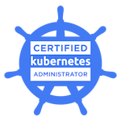
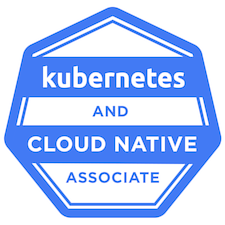

# Hi there 👋, my name is Hristo

I'm a Platform Engineer dedicated to building reliable, scalable, and efficient infrastructure solutions. Passionate about cloud-native technologies, I actively contribute to various open-source projects.
---

## 🛠️ About Me

- 🧑‍💻 Maintainer of:
  - Capsule - [GitHub](https://github.com/projectcapsule/capsule) [Website](https://projectcapsule.dev/)
- 💬 Get in touch with me: [Kubernetes Slack](https://kubernetes.slack.com/team/U07BVSYJC64)
- 🧠 Big brain quote:
"Never trust quotes on the internet."
  Abraham Lincoln, 1462

## 🎖️ Achievements

---

